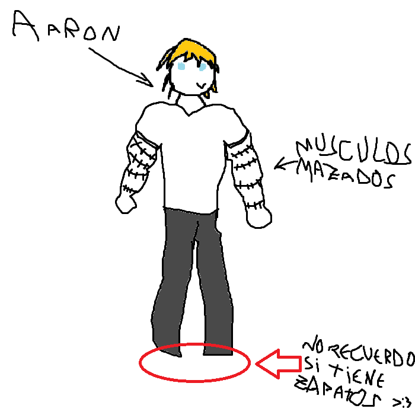

## 
> - Nombre: Aaron🐟 Navia (asi que se llamaba Aaron🐟!)
> 
> - Edad: 20 años, camino a la vejez ya (´；ω；｀)
> 
> - Altura: 1.89 metros, el chico alto de Alice!
> 
> - Peso: 109 kilogramos de musculotes
> 
> - Raza: Humanote
> 
> - Descripción física: Aaron🐟 es un chico musculado, alto, de cabello rubio y ojos azules! sus brazos tienen puntos constantes, puestos ahí para mantener su piel bien cerrada al usar sus habilidades! (ﾉ◕ヮ◕)ﾉ*.✧
> 
> - Descripción psicológica: Nunca he hablado con él, pero parece un buen chico! más relajado que el resto de Alice al menos, diría que está con nosotros más que nada por trabajo que otra cosa! y si hay algo que puedo decir de Aaron🐟, es que luce como que le tienen trabajando mucho, otra demostración de que Adel sobrexplota a sus trascendentes y no les lleva de paseitos (´ε｀ ). Si es que casi nunca lo veo al pobre :'b
> 
> - Vestimenta resonante: Pantalon negro, polera blanca, y ropa interior \[redactada\] (☞ﾟヮﾟ)☞
> 
> - Historia: Aaron🐟 viene de un pueblito pescador! al parecer la semi-diosa que vivía en el mar y cielo de su pueblo fue asesinada por Asmodeus, circulo de la pereza! lo que hizo que las olas se agitarán, y toda la vida natural alrededor de su tierra natal empezase a morir. Ante la posibilidad de que su pueblo fuese destruido, hizo un trato con Adel, quien no alcanzó a presenciar lo ocurrido pero si a llegar a tiempo para ayudar. Adel le prometío que su pueblo estaría a salvo, y él juró estar a su servicio a cambío. Y desde entonces Orias se encarga de mantener esa zona tranquila. Adel literalmente solo ayudó a salvar a las personas al inicio y ahora tiene a nuestra pobre Orias encargada de todo  ¯\\_(ツ)_/¯
> 
> - Dato curioso: Aaron🐟 jugaba futból americano! al parecer era conocido como la mano de hierro en su pueblito, y era el furor de las chicas ヾ(*’Ｏ’\*)/
>
> - representación grafica:
>
> 
>
> > [Volver](Alice.md)