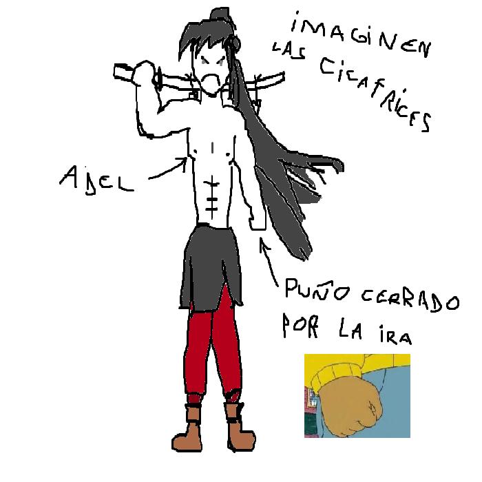

## Adel
> - Nombre: Adel Amsalem (Su apellido significa "buscador de paz" lit (´ε｀ )???)
> 
> - Edad: 43 años y bastante joven se vé >:C
> 
> - Altura: 1.87, es más alto que yo pero solo por pura suerte 7n7
> 
> - Peso: 85 kilogramos de musculo que pronto se le va a ir arrugando y volviendo mas flacido, a menos que termine como Volundr, en cuyo caso:
>
>  (ノ｀Д´)ノ彡┻━┻
>
> - Raza: Humano
> 
> - Descripción física: Adel es un hombretón alto, con musculatura tonificada y entrenada, con un cuerpo lleno de cicatrices, con cabello negro y largo atado como cola de caballo. Sus ojos son de un gris apagado aburridisimo, y huele a tabla. la probabilidad de que en años proximos empiece a quedar calvito es baja, pero nunca cero.
> 
> - Descripción psicológica: Adel ha pasado por mucho, y como tal, la mayoría de cosas dolorosas ya no le afectan, es muy poco empatico y si tiene la oportunidad, acaba con la vida de cualquier demonio en su cercanía. No tiene escrupulos, es irritable, y muy serio como para saber cuando algo es una broma (Digo, si te tocan la puerta y salen corriendo, no llamas a los demás lideres de facción para que castiguen a la bromista que de seguro que lo hizo con buenas intenciones >:'b)
> 
> - Vestimenta resonante: Su alma resuena con unos pantalones carmesí oscuro con un faldar (que antiguamente fue un yukata, pero que ahora no hace más que descansar en su cintura) como el enano electrico, suele ir con la parte superior del cuerpo descubierta. 
> 
> - Historia: Adel solía ser parte del equipo de Blank, antes de la anterior gran purga. los registros hablan sobre como juntos, ellos y Serif, eran capaces de luchar contra circulos del infierno, y lo hicieron, bajo el comando de Euna, pelearon una y otra vez para mantener a raya los ataques de los demonios. Sin embargo, cuando perdió a su hija y esposa a manos del circulo de la avaricia, cambió por completo, y decidió que los demonios debían morir para que la humanidad no sufriese más por culpa de esta guerra interminable. Lo cual no me parece chachi >:CCCCCC
> 
> - Dato curioso: Las tres botellas que van atadas a la funda de su espada (robada del circulo de la avaricia), tienen alcohol, agua, y sangre del demonio mismo, para reconocerle aún si cambia su forma. Tambíen es un amargado, tan tan amargado que si comes con él, la comida se va a volver naranjas arrugadas (Y tambíen va a ser reemplazado por June un día)
>
> - representación grafica:
>
> 
>
> > [Volver](Alice.md)