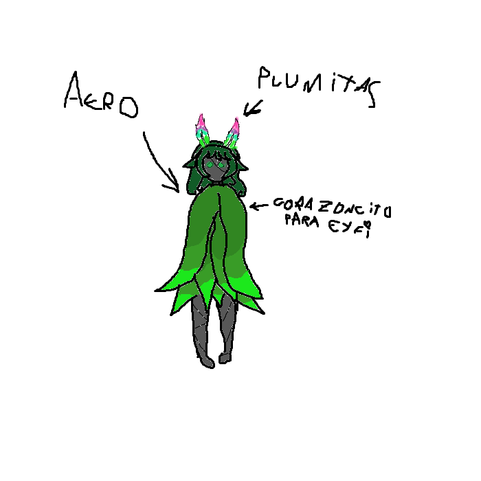

## Aero
> - Nombre: Aero (No sabemos sus apellidos)
> 
> - Edad: No la sabemos, pero por su desarrollo parece que más de 17 años
> 
> - Altura: 1.45, si la pones junto a Kafka, se ven del mismo tamaño, pero ella es un centimetro más pequeña
> 
> - Peso: 15 kilogramos, la energía y los petalos no pesan demasiado!
> 
> - Raza: Semi-hada de las timiditas
> 
> - Descripción física: Aero es una chica sin boca ni nariz, de ojos hechos de luz con un tono verdoso, cabello verde oscuro, y cuerpo hecho de lo que uno diría que son capas de un material similar a pétalos negros, dos plumas grandes salen de la parte delantera de su pelo, plumas coloridas y altas, con un degradado que va desde rojo-fucsia a rosado, a morado en el centro, a verde claro en la parte inferior. Sospecho que es copa A (☞ﾟヮﾟ)☞ 
> 
> - Descripción psicológica: Aero tiene miedo de todo lo que no es un hada o una semi-hada, es amable con la naturaleza del reino vegetal y fungi, pero suele mantenerse alejada de todo lo que se mueve demasiado rapido. Ha pasado por cosas dificiles, asi que no se le pide mucho, solo que ayude con las misiones de vez en cuando. Pese a que tiene miedo nos ayuda, por lo que es una chica muy valiente!
> 
> - Vestimenta resonante: Una capa de hojas gigantes que cubre todo su cuerpo, similar a la capucha de Schwarz! por lo demás, no lleva mucho. su cuerpo tampoco es que tenga algo que esconder, pervertidos! (｀⌒´)
> 
> - Historia: Aero llegó a la organización hace cerca de un año y medio, durante un tiempo estuvo al cuidado de Lily, hasta que conoció a Eyfyen, quien es hoy en día quien le acompaña siempre que quiere ir a algún lado fuera de sus lugares seguros. Al parecer, la organización le ofreció la posibilidad de que se retirase y viviese tranquila en Flora Eterna. Sin embargo, Aero decidió quedarse con nosotros! es una buena chica ♡(ӦｖӦ｡)
> 
> - Dato curioso: Esta loquisima por Eyfyen, yo lo sé, pero no lo vayan contando por ahí, creo que Eyfi es del tipo que friendzonea y no quiero eso para mi chikita verdesita (´；ω；｀) 
>
>   (tampoco creo que Aero misma esté muy conciente de ello, asi que tampoco le cuenten! no arruinen mi headcannon, quieren? >:C)
>
> - representación grafica:
>
> 
>
> > [Volver](Latence.md)