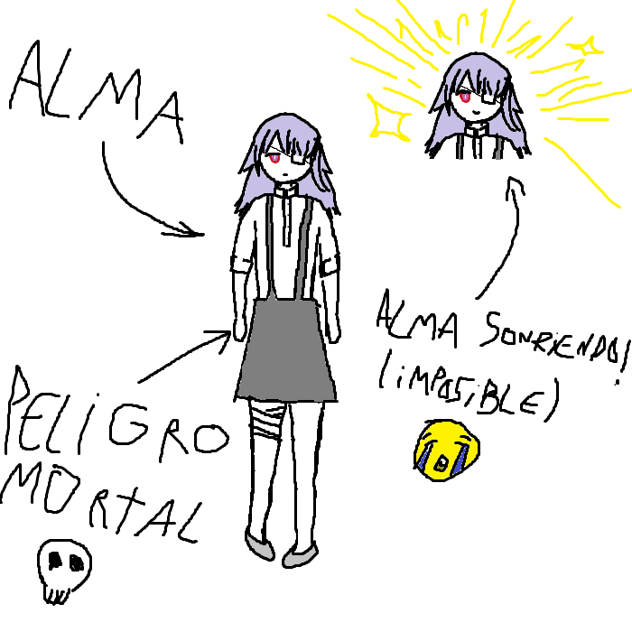

## 
> - Nombre: Alma (Sin apellido conocido)
> 
> - Edad: El Opus finale calculó que unos 18 años, pero como no sabemos su cumpleaños, no podemos saberlo a ciencia cierta, ni tampoco celebrarle los cumpleaños cuando le llegan (⁠´⁠°̥̥̥̥̥̥̥̥⁠ω⁠°̥̥̥̥̥̥̥̥⁠｀⁠)
> 
> - Altura: 1.67, ni alta ni tampoco entre las mas bajitas, la altura en la que nadie te dice nada por lo que mides, ciertamente, una de las caracteristicas que mas miedo dan de Alma (• ▽ •;)
> 
> - Peso: 57 kilogramos, alguien no ha estado comiendose todos los almuerzos que le trae su felino hermano (｀⌒´)
> 
> - Raza: Humana de las misteriosas
> 
> - Descripción física: Alma es una chica con un ojo rojo que se vuelve morado hacia el interior de su pupila, su cabello de un color azul-grisaceo-violetaceo (No me sé los nombres de esos tonos más raros, demandenme (｀⌒´)) tiene copa A, lo que complementa perfectamente su elegante complexión delgada (*˘︶˘*).｡*♡ su expresión suele ser una de pocas emociones, a veces incluso pareciera que ninguna, pese a que tendría una linda carita si sonriera alguna vez, me temo que esto nunca ha sido documentado, nisiquiera durante esa fracción de segundo antes de estornudar! la seguí durante 4 días y nunca jamás de los jamases lo hizo, les juro! tenemos que encontrar los chistes que le hacen gracia, chicos! (⁠｡⁠•́⁠︿⁠•̀⁠｡⁠) 
> 
> - Descripción psicológica: Alma es una combinación de la curiosidad de Orias, la forma de hablar de Euna, y la inteligencia de June! cuando hablo con ella, no entiendo absolutamente nada de lo que dice, es como si hablara otro idioma ╰(⸝⸝⸝´꒳`⸝⸝⸝)╯ Alma no tiene gustos personales, ni tendencias hacia ningún interés particular, diría que es un poco como una maquina, pero lo cierto es que mis maquinas parecieran tener más deseos propios :'o, Alma sufre de perdida de la memoria, pero su caso es bastante diferente al de una persona amnesica común, ya que no parece retener nisiquiera los instintos humanos más comunes, alejarse del peligro, alimentarse, o buscar la cercanía de otros, en sus palabras, ninguno pasa por su mente ( ,・﹏・)
> 
> - Vestimenta resonante: Alma va por la vida con un parche blanco cubriendo su ojo izquierdo, así como una linda falda oscura que se sostiene desde sus hombros, debajo lleva una camisa blanca de brazos cortos, unos vendajes blancos recubren su muslo derecho, pese a que no tiene ninguna herida allí (Tal vez va por un look de enfermera sexy??? le falta el resto del traje de enfermera si es así! (๑ơ ₃ ơ))
> 
> - Historia: Lamentablemente no sabemos si Alma era una enfermera sexy antes de ser traida por Madame Sinclair, ya que cuando llegó a la organización de manos de la Madame de la convergencia ya no habían recuerdos en su mente (Lo que no es lo mismo que perder la memoria). Alma tuvo que ser rapidamente trascendida para mantener la conexión entre su alma y cuerpo, ya que no se reconocían entre sí. Desde entonces, la muchacha ha formado parte de la organización sin estar en ninguna de las facciones, en su lugar, prestandonos sus servicios como un tercero completamente imparcial en los debates entre lideres, a este cargo lo llamaron "El velo de la ignorancia"! ヾ(\*’Ｏ’*)/ aunque tambien tiene otro trabajo, el de borrar la memoria de las muchas personitas que se han visto afectadas por la guerra con los demonios, y prefieren tener un borrón y cuenta nueva, o quizá si es que aún se puede, volver con sus familias como si nada hubiera ocurrido, sus manos son capaces de borrar así de sencillo las memorias de cualquiera (• ▽ •;). Entre las posibles teorías sobre el pasado de Alma, yo creo que fue una enfermera sexy, un ninja, o quizá una supersoldado secreta de algún gobierno! >:OOOOOOOOOOO 
> 
> - Dato curioso: Alma ha tomado las armas humanas de sus lugares antes, y parece ser que la gran mayoría de ellas no reacciona a esto! no puede usar sus habilidades ni blandirlas con facilidad claro, pero no la rechazan tampoco! Por qué? a mí no me pregunten yo solo soy una chica bonita (〃ﾟ3ﾟ〃)
>
> - representación grafica:
>
> 
>
> > [Volver](SinFacción.md)