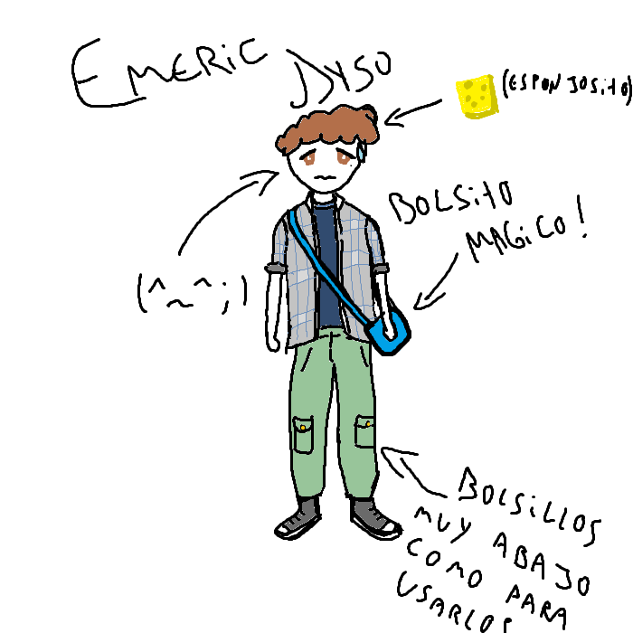

## 
> - Nombre: Emeric Dyso (Emeric por su parte signifca "Poder"! mientras que Dyso, tiene un significado algo más complicado de hallar, pareciera ser un derivado del apellido "Dyson" que viene a significar "Hijo de Denise", la proxima vez que lo vea le preguntaré si su mamá se llama así ╰(⸝⸝⸝´꒳`⸝⸝⸝)╯)
> 
> - Edad: 19 años 
> 
> - Altura: 1.72, pero junto a Kafka luce como de poco más de dos metros
> 
> - Peso: 61 kilogramos 
> 
> - Raza: Humano que se había ido lejitos 
> 
> - Descripción física: Emeric es un chico de complexión media, de cabello y ojos café, piel clara pero no lo suficiente para ser palida. Sus manos tienen callos propios de un escritor avido que tuvo que trabajar en el campo desde pequeño! Bajo su ojo derecho puedes ver un lunar, su pelo tiene rulitos y se ve algo esponjoso (〃ﾟ3ﾟ〃)
> 
> - Descripción psicológica: Emeric es un chico atento y responsable, aunque algo nervioso, tiene un pequeño tic que le hace decir "Um" en casi todas sus frases, y si bien puede parecer algo cobarde en un inicio, es de todo menos eso! (ﾉ◕ヮ◕)ﾉ*.✧ valiente y rapido para adaptarse, Emeric es alguien de fiar con poco que se le pueda echar en cara ヾ(*’Ｏ’\*)/ Sin embargo, parece extrañar su vida devuelta en casa con su familia, ya que fue sacado de ella de forma muy abrusca. Me aclaró eso sí, que no está descontento aquí con nosotros ( ˘ ³˘)♥
> 
> - Vestimenta resonante: Emeric viste con ropa informal, una camisa a cuadros por sobre una polera azul marino, pantalones cargo verdes y zapatillas de punta blanca a juego con su polera. trae tirantes bajo la camisa! una vestimenta propia de un chico normal y bien portado como es el integrante más chikito de Utopía (*˘︶˘\*).｡*♡
> 
> - Historia: Emeric era un chico de campo que vivía en el bosque de la luz vieja (que al parecer, solo es un bosque normal, y no tiene una luz capaz de envejecerte (｀⌒´)) Allí él estudiaba caligrafía con su familia, su padre era su maestro, y vivía una vida tranquila hasta que un día, cuando que estaba rezandole a una estatua de su bosque, fue lanzado al más allá! donde se encontró cara a cara contra el espiritu del circulo de la violencia, Lucifer! (No sé como sobrevivió (• ▽ •;)) pero por suerte, alcanzó a ser rescatado por Solace, quien le salvó del circulo y se lo trajo devuelta al mundo terrenal (Uy ♡(ӦｖӦ｡)) Sin embargo, el circulo alcanzó a poseer la nuca de Emeric antes de que partiera, lo que le trajo devuelta a nuestro mundo, encerrado junto a él >:'0! Emeric no tuvo mucha más opción que volverse trascendente cuando esto ocurrió, y desde entonces ayuda a Utopía a alcanzar la futura paz con los demonios! (Y no hablemos de las contiendas ni todas las cosas que han sucedido por y con Lucifer). Emeric es tambien el aprendiz de [Kafka](Kafka.md)! y nuestro más reciente sellista en la organización, y eso si que lo eligió él! (ʃƪ＾3＾)
> 
> - Dato curioso: A Emeric le gustan las personitas de pelo rubio, sexo dudoso, ojos morados y  g a m e r s .  Y tambien tiene una mascota invisible viviendo en su casa, sin tener la más minima idea de qué es (Quizá un pulpo???????????????????? ヾ(*’Ｏ’\*)/)
>
> - representación grafica:
>
> 
>
> > [Volver](Utopía.md)