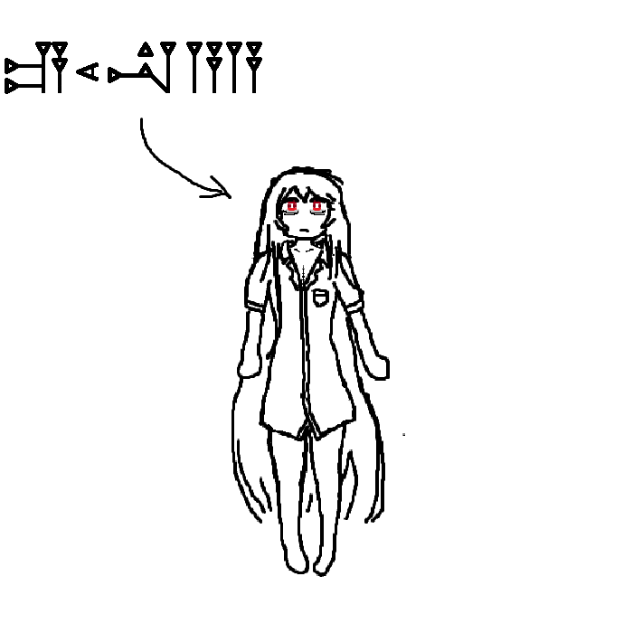

## Euna
> - Nombre: Euna (Al parecer, el nombre fue escrito por primera vez en el "alfabeto" cuneiforme sumerio, Euna me enseñó a escribir su nombre en ese alfabeto, sin embargo, preferí colocar ese en la representación grafica!)
> 
> - Edad: de 5000 a 6000 años! aunque su cuerpo aparenta de 25 a 30
> 
> - Altura: 1.64, La lider de Latence, como siempre, tiene el punto medio entre el lidersote de Alice y la lidercita de Utopía!
> 
> - Peso: 44 kilogramos, suelo ver el numero 4 bastante por ahí, traten de que esta información no llegue a Croix o tendran otra clase conspiranoica chicos!
> 
> - Raza: Semi-humana (??????) Humana inmortal (???????????)
> 
> - Descripción física: Euna es una mujer de cabello blanco y largo, con un cuerpo de apariencia fragil, ojos rojos cansados con ojeras, copa B (que podría ser C si comiese más!), y una cicatriz en forma de rama de olivo. (es discutida la naturaleza de la rama, pero insisto en que a mí me parece de olivo, Croix (｀⌒´)) 
> 
> - Descripción psicológica: Euna es... observante? tiene una apreciación enorme por la vida, sin embargo, a veces esa apreciación significa permitir a la vida acabarse, mientras que otras significa protegerla. Euna parece tener en claro que hacer según su filosofía vital en todo momento. Es comprensiva, pero fría, sus palabras dan una impresión de mecanisidad, pues ha hablado con tantos humanos que en muchas ocasiones las conversaciones se repiten para ella. Hay varios motivos por los que permanece en su Alma Terrena, y uno de ellos es para combatir ese sentimiento, pues Euna teme que si se expone demasiado al mundo, verá todo lo que puede verse, y terminará perdiendo el sentido de la maravilla que siente por los seres vivos. Es imposible saber lo que pasa por su cabeza cuando admira el mundo en blanco de su alma. (Aunque han habido avistamiendos de Alma acompañandole en ello!) 
> 
> - Vestimenta resonante: Una camisa blanca. La ropa interior es opcional! ♡(ӦｖӦ｡)
> 
> - Historia: Euna ha vivido miles de años maldita por Mephisto, hecha inmortal para que viese a todos a su alrededor morir. ha pasado de civilización en civilización, formando lazos con las personas más influyentes de todas las eras, se ha encargado por su propia cuenta de liderar la organización desde antes de que cualquier trascendente vivo naciese. Si bien esta viejita, se la quiere mucho desde todas las facciones.
> 
> - Dato curioso: Durante sus reuniones para tomar el té con Madame Sinclair, Euna deja de respirar! incluso si la reunión dura días, Euna no respira nisiquiera un poquito de ese morado humo de la Madame. Al parecer, porque en el pacto entre ambas, una de las reglas es que ninguna dañaría en la mas minima forma a la otra, y respirar su humo significaría arrancar una infinitamente pequeña parte de la Madame! (literalmente)
>
> - representación grafica:
>
> 
>
> > [Volver](Facción.md)