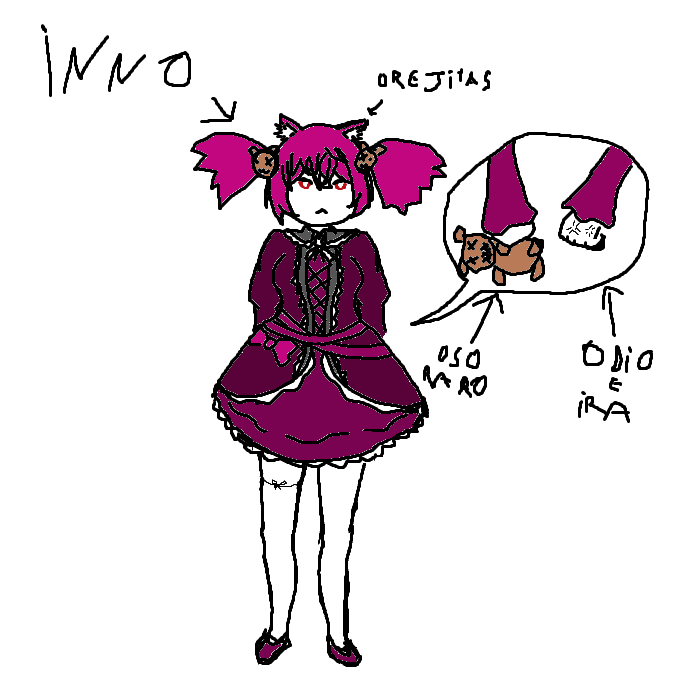

## 
> - Nombre: Inno [Apellido de Exael aquí] Nachteil (Significa "desventaja" o "inconveniente"! aunque no creo que Inno se refleje mucho en ese signficado (´ε｀ ))
> 
> - Edad: 19 años! parte de la nueva generación de trascendentes  (*˘︶˘*).｡*♡
> 
> - Altura: 1.62, cientificamente inferior a mí 😎
> 
> - Peso: 50 kilogramos! ni pa tí ni pa mí
> 
> - Raza: Semi-demonio de las enojás 
> 
> - Descripción física: Inno es muy linda, como un 11/10 en lindura, sus ojos son profundos, de una tonalidad roja-oscura, su cabello es de un color fucsia oscuro, y pese a que no lo cuida mucho, se mantiene casi perfecto en luminosidad y suavidad, lo suele llevar atado a ambos lados, de forma que quedan dos pompones apretables. Su piel es practicamente perfecta, sus manos, pese a las cosas horribles que son capaces de hacer, lucen como si hubiesen sido moldeadas a partir de las nalgas de dios bebé mismo, tersas y delicadas, con una complexión natural capaz de competir con cualquier estandar cultural de belleza, he de recalcar que Inno, fisicamente, se encuentra en un estrato superior de lindura, sus piernas rivalizan con las de June (aunque en lo personal considero que los de la futura lider de Alice son superiores en cuanto a firmesa y envergadura), sus labios tienen una cantidad objetivamente perfecta de grosor, y sus oídos, no me hagan empezar con sus malditos oídos (ᗒᗩᗕ). total, que es muy putamente hermosa >:C, pero saben qué? no todo en esta vida es la belleza fisica! hay cosas mucho más importantes. MIERDA ACABO DE REVISAR LOS DATOS QUE ME DIO SEI, es copa C, si que lo tiene todo (ノ｀Д´)ノ彡┻━┻
> 
> - Descripción psicológica: Inno es una persona violenta, que odia profundamente a los humanos y demonios, lo que significa que usualmente no soporta ni hablar con ellos, reactuando de formas que pueden llegar a dañar los sentimientos de quienes solo quieren saber un poquito más de ella para hacer su perfil. Sei dice que tiene su lado blandito pero personalmente nunca jamás lo he visto y ya no quiero que me siga mirando feo ┻┻ ヘ╰( •̀ε•́ ╰) 
> 
> - Vestimenta resonante: Inno lleva un vestido similar a los Gothic Lolita, entenderán que esa especie de vestidos tan complicados con tantos detalles es algo que me da muuuuucha pereza explicar, asi que solo miren el dibujo (´ε｀ ), ah, tambíen tiene esta especie de hilo atado a su muslo? me gustaría pensar que solo está ahí para resaltar lo blando y apretable que lucen, pero si es parte de la vestimenta resonante debe tener algún significado? lleva tambíen unas coletitas de osito, similar al que lleva a todos lados, esas si que me parecen bastante bonitas (〃ﾟ3ﾟ〃). Sus medias altas blancas son una ventaja injusta que le dá la naturaleza.
> 
> - Historia: Inno es hija de Exael, circulo de la Gula, como tal, fue entregada a la familia más cercana que tenía su madre, y fue en manos de otras personas que desarrolló su visión de mundo. Fue traida a la organización tras hacer un pacto con Adel, a quien le ofreció obedecer sus ordenes en tanto le diese la fuerza para matar a su padre-madre (Estos demonios y su genero indefinido X'D) no voy a entrar mucho en los detalles de su pasado, pero esta claro que tiene los motivos para ser como es. y espero que un día eso pueda cambiar para mejor (• ▽ •;)
> 
> - Dato curioso: SE ROBÓ A SEI >:'''''''''U ME LA ROBÓ ME LA ROBÓ ME LA ROBÓ Y SEI YA NO VIENE A VISITARME Y AHORA ESTOY SOLITA CON MI GATO ROBOT Y MIS ROBOTS Y NO ME LA QUIERE DEVOLVER :''''''U SEI DE LOS PERFILES SI ESTÁS LEYENDO ESTO POR FAVOR NO DEJES QUE TE ROBE TAMBÍEN!!!
>
> - representación grafica:
>
> 
>
> > [Volver](Facción.md)