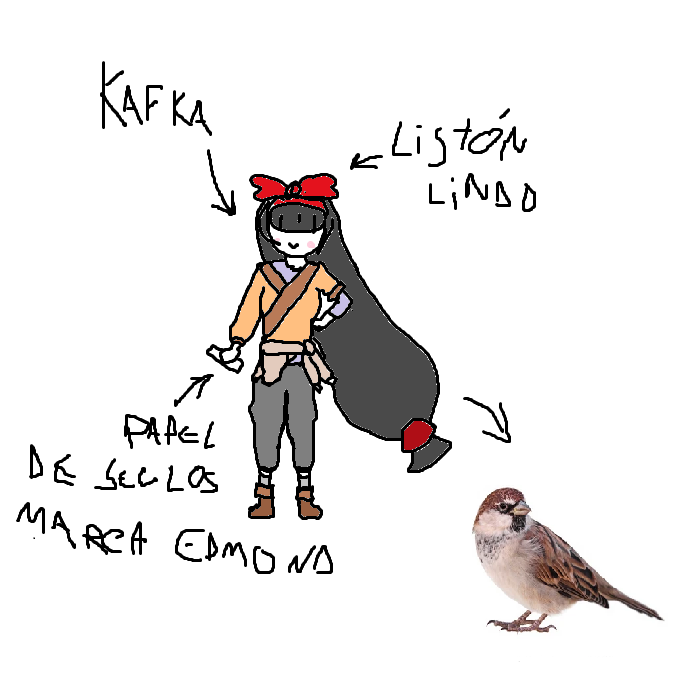

## Kafka
> - Nombre: Kafka Vogel Eingesperrt (Vogel significa pajaro! muy bonito apellido Kafka, eres linda como un pajarito! >:3)
> 
> - Edad: 25 años! toda una adulta
> 
> - Altura: 1.46, como siempre digo, mientras sea más que Iõ, ta bien 👍
> 
> - Peso: 5 kilogramos (te faltan unas buenas hamburguesas Kafka! de niña pesabas lo que un pajarito? >:'0)
> 
> - Raza: Humana de las tiernitas
> 
> - Descripción física: Kafka es pequeña y atletica, muy muy agil! su cabello es largo y negro, y su flequillo cubre sus ojos toooodo el tiempo, al punto en que se acostumbró a vivir sin su vista, a efectos practicos siendo una persona ciega. Kafka no usa sostén, por lo que no tiene copa. sin embargo, a vista, puedo inferir que debe tener copa B. (de las chikitas)
> 
> - Descripción psicológica: Kafka es una chica animada, amable, incapaz de medir el espacio personal, muy tocona y un 7/10 en la escala de curiosidad. Cuando se pone seria, es bastante comprensiva, y muy inteligente, sin embargo, da los peores consejos de toda la organización, consejos que a veces desafían cualquier tipo de logica o respeto por las leyes del hombre y de dios. 
> 
> - Vestimenta resonante: Kafka no resuena con ninguna ropa en particular, ya que la resonancia de su alma es infima, sin embargo, suele ir con unas cuantas prendas al azar de entre su ropero. Ropa que le hace lucir como una especie de monje con un gran moño manteniendo su flequillo en su lugar.  
> 
> - Historia: Kafka nació en una familia de sellistas al servicio de Euna, de entre su familia de siete hermanas, siempre supieron que sería ella la elegida por el talento natural de poder sellar. y así, cuando nació, se le dejó al cuidado de la, por aquel entonces, sellista de la organización, quien le crió para que se volviese la linda muchacha que es ahora. (´•ω•｀♥)
> 
> - Dato curioso: Kafka tiene muchas plantitas! varias de ellas tienen nombre, y algunas son; Albertiño, Salamanta, Gutierrez, Pine, y Jazmin
>
> - representación grafica:
>
> 
>
> > [Volver](Latence.md)