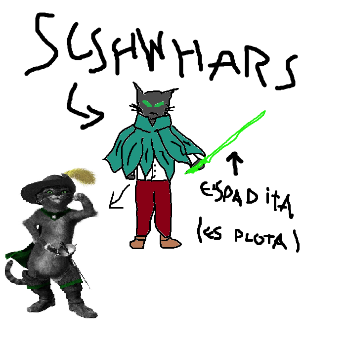

## 
> - Nombre: Schwarz Friedrich (Su apellido significa "Principe de la paz"! y su nombre "pelinegro"! aunque no creo que sus padres fuesen a imaginar la cantidad de pelo negro que terminaría teniendo (☞ﾟヮﾟ)☞)
> 
> - Edad: 26 años
> 
> - Altura: 1.20! es mas bajito que el enano electrico, sin embargo, nadie lo considera así! Schwarz da una vibe de ser más alto en mente que en cuerpo suficiente para que podamos seguir considerando a Iõ como el más pequeño de la organización (esto tambíen cuenta para la hadita de frutillas lider de utopía!)
> 
> - Peso: 30 kilogramos, está algo delgadito, creo! 
> 
> - Raza: Humano y gato
> 
> - Descripción física: Schwarz tiene un cuerpo similar al de un gato y similar al de un humano, bipedo, con garras y almohadillas en los dedos (aunque no en la palma!) su craneo tiene la apariencia del de un felino, con ojos grandes y dorados de gatititito, sus orejas y cola tambien están a la par! indudablemente, el chico gato de Latence! 
> 
> - Descripción psicológica: Schwarz es alguien serio, de caracter fuerte y poca piedad con aquellos a los que les falta esfuerzo para cumplir las metas que se proponen. Es alguien que se interesa por ayudar a los demás, pero solo hasta cierto punto, pues tambíen considera que todos deben poder valerse por sí mismos. Schwarz es bastante maduro, sin embargo, se encuentra en Latences debido a su indecisión, ya que aún no logra tomar una postura en el conflicto interno y externo en el que se ve atrapado! alguien bastante genial y respetable a mi parecer (ﾉ◕ヮ◕)ﾉ*.✧
> 
> - Vestimenta resonante: Schwarz resuena ron ropita de hojas! similar a la de Aero, utiliza un look que se vé mucho entre las haditas pertenecientes a Nexus, guardían de las hadas mas sombrías! y consiste en un poncho de hojas verde agua con cuello alto (que en mi opinión parece una flor!), sin embargo, bajo ese poncho viste una camisa blanca, pantalón rojo, y unas lindas botas que se combinan con el pantalon! 
> 
> - Historia: Schwarz fue salvado por Madame Sinclair cuando era niño, estando a punto de morir entre los escombros de su hogar, la Madame fusionó su cuerpo con el de un gato que tambien se hallaba moribundo, salvando de ese modo a ambos, y volviendolos uno solo. Schwarz aún lucha con lo que siente acerca de la Madame, sin embargo, como trascendente, cumple sus labores en Latence impecablemente! siendo uno más de nosotros, que nada tiene que envidiar a ningún otro trascendente.
> 
> - Dato curioso: Puede vomitar bolas de pelo! no es bonito de ver (๑ơ ₃ ơ)
>
> - representación grafica:
>
> 
>
> > [Volver](Latence.md)