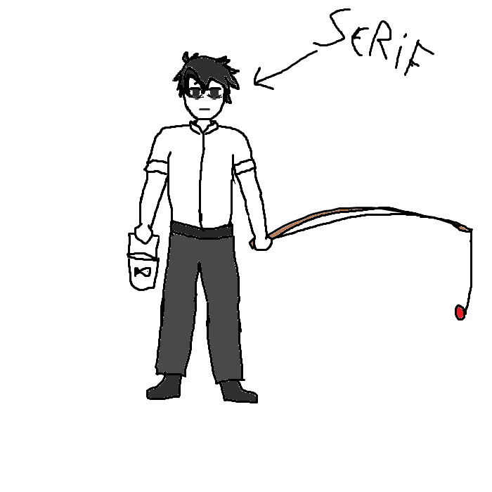

## 
> - Nombre: Serif Novem (Su apellido significa... Nueve? >:0? por qué nueve?)
> 
> - Edad: 43 años, pero menos viejo y amargado que Adel 
> 
> - Altura: 1.75
> 
> - Peso: 60 kilogramos, le diría que coma más, pero le suelo ver intentar alimentar al fantasma sobre su hombro ( ,・﹏・)
> 
> - Raza: Humano con sueñito
> 
> - Descripción física: Serif es un hombre de cabello negro, con ojos oscuros muuuuuuuuuuuy cansados, sus ojeras están tan marcadas que si un cirujano plastico las viera, pensaría que salió de una mala operación! (• ▽ •;) Serif se vería bastante wapo de no ser por eso, tambíen hay que tener en mente que ya es un cuarentañero, por jovenes que luzcan los trascendentes, Serif al igual que Adel está ya con un pie en la tumba (Volundr donde está entonces????? (⁠⁠ﾉ⁠ω⁠＼⁠⁠)). Su complexión es delgada pero atletica, y su pelo desaliñado puede ser utilizado como nido por pajaritos sin que él se dé cuenta. Por lo demás, Serif luce literalmente solo como un sujeto cualquiera con mucho sueño (sobrepasa los limites de la imaginación, lo sé (ﾉ◕ヮ◕)ﾉ*.✧ ).

> 
> - Descripción psicológica: Serif está muy cansado, por lo que la gran mayoría de las cosas ya no le tienen tanta importancia, como tal, se podría decir que es algo despreocupado, aunque tambíen bastante acertivo! Como alguien que puede ver el futuro, es muy dificil sorprenderlo, asi que mejor ni lo intenten si les toca de santa secreto. (ノ｀Д´)ノ彡┻━┻
> 
> - Vestimenta resonante: Serif forma parte del club de las camisas blancas, y del club de los pantalones negros. Suele llevar los brazos arremangados.
> 
> - Historia: Serif creció en la organización y fue entrenado desde pequeño como el futuro sucesor del anterior vidente, sin embargo, su capacidad de ver el futuro era muy reducida, por lo que se pensaba que talvez otro tomaría su lugar. Sin embargo, tras los eventos de la purga, sus habilidades cambiaron y le otorgaron la capacidad de discernir el destino con mucha mayor intensidad, a cambio de su capacidad de perder la conciencia, de dormir o caer noqueado, incluso bajo sedantes y fuertes medicaciones, su mente es incapaz de apagarse por un solo momento! antiguamente era parte del legendario equipo de Blank, pero hoy en día no es más que la mano derecha del apestoso de Adel (｀⌒´)
>
> - Dato curioso: Cuando era más joven, las leyendas dicen que era todo un don juan (☞ﾟヮﾟ)☞
>
> - representación grafica: (Como lucía como un sujeto con ojeras cualquiera pensé que sería muy aburrido y lo dibujé llendo de pesca)
>
> 
>
> > [Volver](Alice.md)