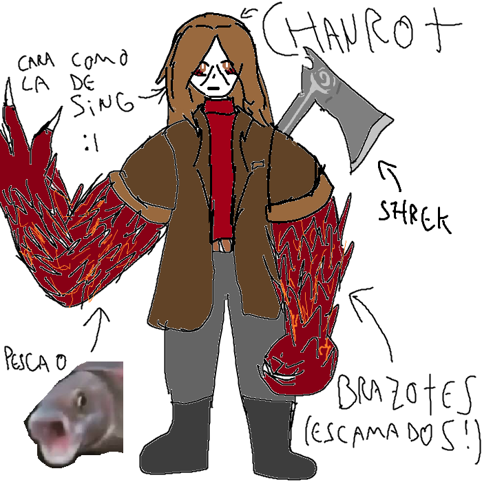

## 
> - Nombre: Shanrot Ingrath (No hay mucho registro del significado de ninguno, sin embargo, ingrath me suena a "Enfurecido" en inglés, mientras que Croix describe que Shanrot parece una palabra compuesta que significa "Cosa podrida". Shanrot tambien puede ser una variación del nombre "Sharot" que significa "Confesión". Finalmente, el nombre de Shanrot vendría a significar la confesión de una cosa podrida enojada. Que alivio resolver el misterio! ╰(⸝⸝⸝´꒳`⸝⸝⸝)╯)
> 
> - Edad: 20 años 
> 
> - Altura: 1.82, Nioi alimentó bien a este muchacho!
> 
> - Peso: 87 kilos bien escamados
> 
> - Raza: Semi-demonio de los escamosos (Denominados variante pescado flamenante por la todapoderosa Edmond ヘ(￣ω￣ヘ))
> 
> - Descripción física: Chico de complexión robusta, con espalda ancha, brazos escamosos gigaaaaaaantes de color bermellón y pelitos de color anaranjado claro entre las escamas! (Al principio dejan una fuerte impresión, pero si pasas mucho tiempo con él, dejas de notarlos >:b) Es a la vez muy expresivo y muy poco expresivo, sus ojos son color café oscuro, y su pelo ondulado es de castaño aún mas oscuro! Llega como a la mitad de su espalda, parece dificil de peinar (• ▽ •;)

> 
> - Descripción psicológica: Shanrot parece alguien calmado, que resulta complicado alterar, pero tambien es apasionado sobre ciertas cosas, como su familia, la cocina o conocimiento general! Es una persona que no tiene dificultades para hablar largo y tendido, resulta alguien bastante sociable. Sin embargo, vivió toda su vida en una burbuja (No de las de Jabón!) por lo que tiene algunas complicaciones en su día a día, pero es un muchacho inteligente asi que se las arregla bien (๑ơ ₃ ơ). 
> 
> - Vestimenta resonante: Shanrot viste una gabardina con pantalones grises, y botas negras! Nada muy complicado, es como un leñador muy estiloso (ﾉ◕ヮ◕)ﾉ*.✧
> 
> - Historia: Shanrot fue adoptado por el espiritu de Nioi, una antigua trascendente, él, junto a la pequeña [Sing](Singularity.md) y su hermanito menor Sfair, creció en una cabañita tranquila donde aprendió a cocinar, estudió y pasó una buena infancia y adolescencia, en un punto Sing se tuvo que ir para resolver sus problemitas con Nadine, pero ellos dos continuaron viviendo con Nioi, pero luego llegó Izrafil de alguna forma al interior de la realidad de bolsillo, y lo tenía que arruinar todo (ノ｀Д´)ノ彡┻━┻ Cosa que se llevó a Sfair con ella y lo dejó tirado en un desierto(??????) bastante feo de su parte la verdad >:C
 
> 
> - Dato curioso: Es parte mono, le encantan los arboles y subirse a ellos, y además un awelo le levantó el dedo de en medio para lo que se defendió con Alma Terrena y todo (Te estoy mirando [Tahir](Tahir.md) (｀⌒´))
>
> - representación grafica:
>
> 
>
> > [Volver](Latence.md)