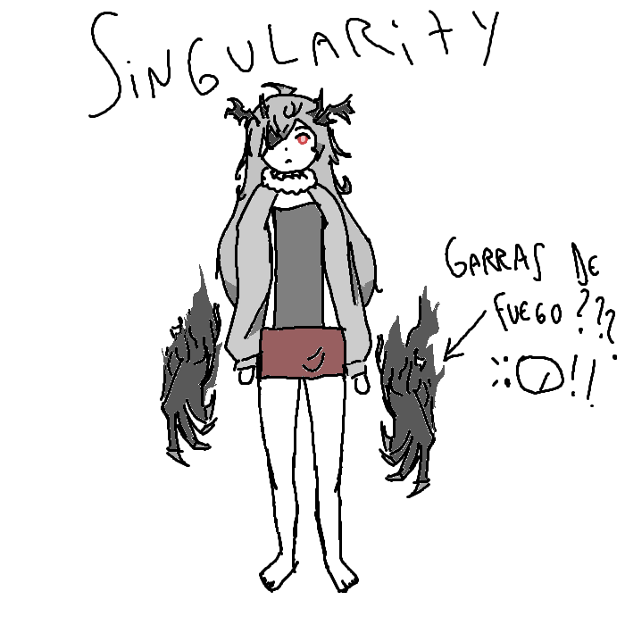

## 
> - Nombre: Singularity (No tiene apellido! Sing fue adoptada por el espiritu de una trascendente cuando tenía 12 años, según ella, no recuerda haber tenido familia alguna antes de esa)
> 
> - Edad: 21 años, aún en la flor de su juventud! 
> 
> - Altura: 1.72, me gana por dos centimetros! eso no se vale (｀⌒´) 
> 
> - Peso: 73 kilogramos, Se alimenta bien la lobita de Utopía! ♡(ӦｖӦ｡) Si bien puede parecer que se encuentra sobre su peso ideal, lo cierto es que su salud se encuentra en perfectas condiciones gracias al ejercicio constante. aunque agradecería que nos dejara un poquito mas de carne en las convivencias de la facción (⁠｡⁠ﾉ⁠ω⁠＼⁠｡⁠)
> 
> - Raza: "%-¿"$)9ERROR75839?11293845" Otro error de la maquina! esto tambien ocurre con el enano electrico, no sabría decir muy bien por qué (๑ơ ₃ ơ) aunque es obvio que ella es un semi-demonio (ﾉ◕ヮ◕)ﾉ*.✧
> 
> - Descripción física: Singularity es una chica de pelo descuidado color grisaceo con puntas negruzcas, cuernos negros y de forma no homogénea, con varias zonas filosas y puntiagudas, así como un bonito ojo color arcilla roja. Lamentablemente no conoce su copa ya que nunca ha usado sostén (• ▽ •;) pero creo que se debe encontrar entre las mas pequeñas, ya que no se le escapan de ese rectangulo de tela que tiene por delante, un verdadero milagro divino! ヾ(*’Ｏ’\*)/
> 
> - Descripción psicológica: Sing es una chica callada, pero altamente particular! Tiene una moral impecable, a la vez que una forma de entender el mundo que se distancia mucho de la del resto de personas, se le dificulta mucho la tecnología, pero en el resto de cosas es bastante independiente, y muy muy inteligente, si bien algo torpe en ocasiones al interactuar con otros, Singularity siempre está dispuesta a darlo todo de sí por otras personas! al punto en que puede resultar un poquito demasiado, si bien gracias a ello ha logrado pacificar a numerosos espiritus (⁠｡⁠•́⁠︿⁠•̀⁠｡⁠)
> 
> - Vestimenta resonante: Su ropa es... dificil de explicar, pero lo voy a intentar! (ʃƪ＾3＾）Singularity usa una falda corta, un parche negro en el ojo derecho, y una parte superior extravagante con sus brazos cubiertos por tela blanca, un cuello lanudo, y su parte delantera cubierta por un rectángulo de tela que deja ver los laterales de su cadera y el centro de su pecho, mantenido en su lugar por la falda. Si bien su ropa es altamente reveladora, Singularity siempre se mueve y ataca de forma tal que nunca nada se logra terminar de ver! Aunque creo que no lo hace a proposito (〃ﾟ3ﾟ〃)
> 
> - Historia:  Sing fue durante toda su niñez algo mas parecido a una bestia, creció sola en los bosques, criada por la cruel naturaleza, comió toda clase de cosas raras, alimentandose de animales de todos los tamaños, así como cualquier hongo o fruta que viera (NO HAGAN ESTO EN CASA NIÑOS! (• ▽ •;)). No creo que sea necesario entrar en los detalles de lo que ocurrió entre esto y el momento en que fue adoptada, sin embargo, en sus instintos animales, Singularity hizo cosas de las que nunca ha podido perdonarse, razón por la que despues de muchos años desaparecida de la faz de la tierra, siendo cuidada por el espiritu de la trascendente Nioi junto a otros dos pequeños semi-demonios, Singularity volvió en busca de Nadine, quien por aquel entonces formaba parte de Alice. Sing planeaba dejarse morir a sus manos por todo el daño que el había hecho. Nadine no logró hacerlo, mas tampoco pudo perdonarle, y ambas lloraron ese día. Al volver a la organización, Singularity fue puesta bajo el cuidado de Nadine durante dos años para comprobar si de verdad había cambiado, y tras todo ese tiempo juntas, era efectivo que Singularity ya no era la misma que de pequeña. Ambas se volvieron muy cercanas pese a su doloroso pasado, y juntas, se volvieron el ejemplo viviente de que la humanidad y los demonios pueden convivir, de que incluso las bestias sedientas de sangre pueden mejorar y de que incluso habiendo sido dañadas mas allá del reconocimiento, el ciclo de odio y venganza puede ser detenido. Juntas, se les llama el caso "SN", Singularity-Nadine. Extrañamente, sus nombres reflejan perfectamente lo que este caso significa; Singularity, que viene a significar singularidad, es una anomalía sin precedentes, y Nadine, que significa esperanza, es la prueba viviente de la posibilidad de un mundo donde la paz entre humanos y demonios no es un sueño imposible. (NO ESTOY LLORANDO, NO LO ESTOY HACIENDO! USTEDES ESTAN LLORANDO! SOY UNA TRASCENDENTE FUERTE Y TODOPODEROSA OYERON?!?!?!?!? :''''''''''''''''''''UUUUUUU)
> 
> - Dato curioso: Singularity tiene una pequeña pasión por la escritura, asi que nunca pide que le impriman nada y siempre escribe a mano todo lo que necesita tener escrito, como sus apuntes de diferentes artes de combate o de las diferentes armas humanas, al parecer, le gusta mucho escribir porque le reconecta con su madre y sus hermanos, quienes le enseñaron a hacerlo. (Espera espera, eso es muy dulce no? (´；ω；｀) mi corazoncito no puede :'''''b)
>
> - representación grafica:
>
> 
>
> > [Volver](Utopía.md)