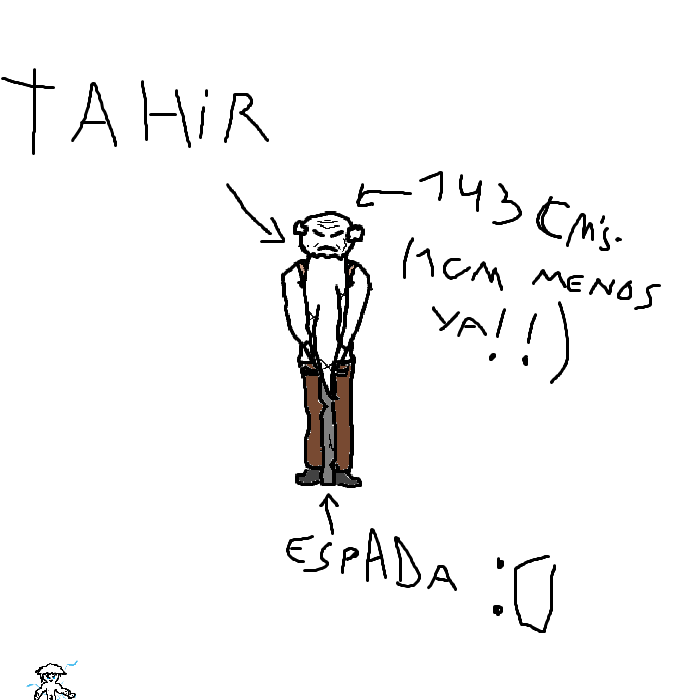

## 
> - Nombre: Tahir Iskhaq (Su apellido significa "aquel que ríe", parece ser un apellido de ascendencia asiria! esto concuerda con su tendencia a reirse de los demás >:'b)
> 
> - Edad: 143 años! fresco como una lechuga! (Sus arrugas pueden parecer como si su cara fuera una desde la perspectiva correcta!) 
> 
> - Altura: 1.44, Por algún motivo, se volvío mas chikito a medida que envejeció. a su ritmo de encogecimiento, calculo que dentro de otros 950 años aproximadamente, Tahir será de un solo centimetro! ヾ(\*’Ｏ’\*)/ Aquello que ocurra cuando su altura sea negativa significará un cambio en la ciencia como la conocemos! confío en que un día, gracias a Tahir, podremos demostrar la existencia de la materia negra (ﾉ◕ヮ◕)ﾉ*.✧ (Se que no estás leyendo esto Tahir, pero sigue así!)
> 
> - Peso: No sé, no lo puedo pesar por telefono y él no se quiso pesar >:C pero ya que solo podemos imaginarnoslo, imaginemos que pesa como unos 230 kilogramos
> 
> - Raza: Humano viejito (En un espectro de humano pequeñito)
> 
> - Descripción física: Tahir es un viejito pequeño que va siempre muy encorvado, de piel morena, cabeza semi-calva y barba laaarga, delgado, de brazos y piernas escuetas y con cara de pocos amigos (´ε｀ )
> 
> - Descripción psicológica: Tahir es alguien irritable, racista, sexista, egolatra, egocentrico, boomer, un supremacista energetico que sin embargo, parece tener un corazón amable cuando no está enojado ni triste por sus novelas.
> 
> - Vestimenta resonante: Lo cierto es que Croix no ha podido conseguir la vestimenta que resuena con su alma, ya que Tahir nunca ha dado la oportunidad para que esto se revise, prefiere vestir con su propia ropa común, que normalmente consiste en una camisa, tirantes beige y pantalones café oscuro. acompañado siempre de su fiel bastón, una espada desgastada sobre la que se enoja bastante si le preguntan! (´°̥̥̥̥̥̥̥̥ω°̥̥̥̥̥̥̥̥｀) )
> 
> - Historia: Tahir fue un trascendente de la organización muchos años atrás, un maestro de la manipulación energetica que nunca tuvo problemas para poder controlarla! lamentablemente, una vez todos los seres humanos por los que luchaba partieron al más allá, Tahir sintió que ya no tenía motivos por los que formar parte de los conflictos del mundo, y se retiró de la organización para vivir una tranquila vida nomade entre las diferentes ciudades interesantes del mundo, parece ser que entre sus proximos destinos se hallan Flora Eterna y Tyr, por lo que si se pasan por alguno de ellos, asegurense de visitarlo! hablar con él es toda una... experiencia (๑ơ ₃ ơ) Tahir fue maestro de muchos trascententes, libró incontables peleas y ahora es simplemente un abuelito fachero. Su casa tiene un intrincado mecanismo hecho por el anterior mecanico de la organización! mi antesesor ahora en el más allá ヾ(*’Ｏ’\*)/
> 
> - Dato curioso: Parece ser que recientemente entrenó a "tres pajeros"! me los describío como un trío de incompetentes, flojos y con una horrible capacitación para misiones de campo, que no supieron ver el potencial de la enegía ni tomarse el tiempo de estudiarla, unos completos idiotas sinvergüenzas sin ningún futuro. (Parece ser que le cayeron bien! solo dijo la mitad de insultos de los que suele decir de Volundr! y soltó un par de carcajas mientras hablaba de ellos ♡(ӦｖӦ｡))
>
> - representación grafica:
>
> 
>
> > [Volver](Facción.md)