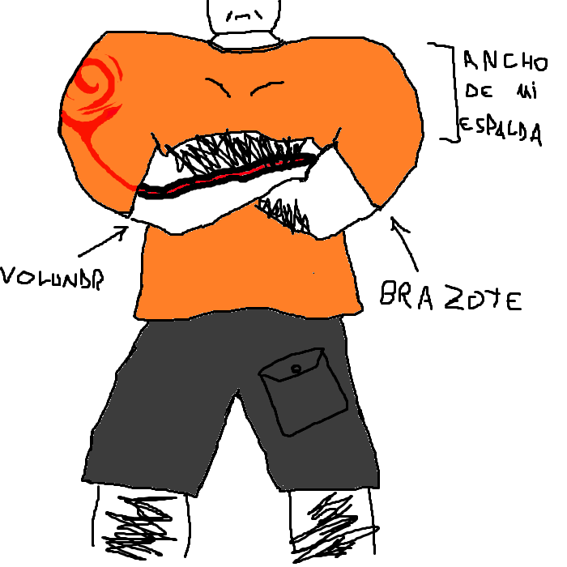

## Volundr
> - Nombre: Volundr Gramhart (Su apellido significa "Corazón adolorido" aunque no hay muchos registros de este por ahí! también puede significar "Dolor duro"! bastante interesante )
> 
> - Edad: 73 años, es el awelito de Utopía :'3
> 
> - Altura: 2.45, Volundr es como los viejitos bajitos, pero a la inversa, solo se vuelve mas grande con la edad
> 
> - Peso: 165 kilogramos de puro musculo! ヾ(<*’Ｏ’\*)/
> 
> - Raza: Humanote
> 
> - Descripción física: Volundr es un hombre de piel morena, enorme, con cabello negro corto, enoooooorme, con manotas del tamaño de torsos y musculacos con musculos en los musculos, tambíen tiene una marca que sube por su brazo hasta llegar a su hombro, donde se forma una espiral. esta marca se ilumina en un tono rojizo similar al de la lava, ¿mencioné que es enorme? un verdadero especimen de lo que es tener un cuerpo mazado y macerado! (ﾉ◕ヮ◕)ﾉ*.✧ 
> 
> - Descripción psicológica: A Volundr no le gusta hablar mucho, y cuando lo hace, es porque considera que es importante lo que tiene que decir. Es alguien experimentado, calmado, y tiene un aire a maestro sabio de anime. Aunque no se confundan! Volundr tambien puede dar malos consejos a veces! una vez me dijo que debía añadirle un sistema de autodestrucción a mis constructos por si un día se revelaban contra la humanidad, pero eso nunca va a pasar! todos sabemos que eso solo ocurre en la ficción Volundr por favor, ya, siga leyendo (´ε｀ )
> 
> - Vestimenta resonante: Una polera naranja, y unos shorts (que en teoría son pantalones, pero se le ven como shorts) todo un amo de la moda el Volundr 
> 
> - Historia: El abuelo del abuelo de Volundr era herrero, su hijo era herrero, el hijo de su hijo era herrero, y el hijo de su hijo (sorpresivamente) se volvió herrero, por lo que este ultimo hijo [padre de Volundr] le enseñó a ser (no se lo van a creer) herrero! Por supuesto, eso no es todo lo que es Volundr, sin embargo es su raiz! proviniente de una familia de herreros en el pueblo minero de Tyr (Actualmente utilizada solo por maquinas de la todopoderosa Edmond (☞ﾟヮﾟ)☞). Volundr hizó un arma para un trascendente ahora retirado, quien pasaba por su pueblo para cazar a un demonio, pocos días despues el trascendente volvío con Volundr a la organización, se volvió su maestro, y desde entonces, "El ejercito humano" fue lentamente ganandose su renombre en la antigua facción unica de Aetheris. Volundr lleva poco más de 50 años creando armas para los trascendentes, y hoy en día aún trabaja con nosotros! tiene una poderosa hijita y un aún mas poderoso poder en esas manotas 
> 
> - Dato curioso: Una vez golpeó a una vieja (era violenta).
>
> - representación grafica:
>
> 
>
> > [Volver](Utopía.md)